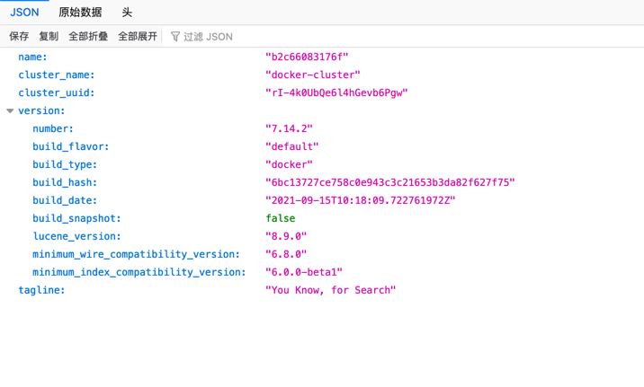

# 本地elasticsearch服务器

|功能| 命令                 | 备注                                                                                    |
| --- |--------------------|---------------------------------------------------------------------------------------|
|启动elasticsearch| `./start-elasticsearch.sh` | elasticsearch browser访问：[http://localhost:9200/](http://localhost:9200/)  |
|停止elasticsearch| `./stop-elasticsearch.sh`  | 将清空所有network和volume                                                                   |

如果访问 http://localhost:9200/ 出现如下图，表明成功  

