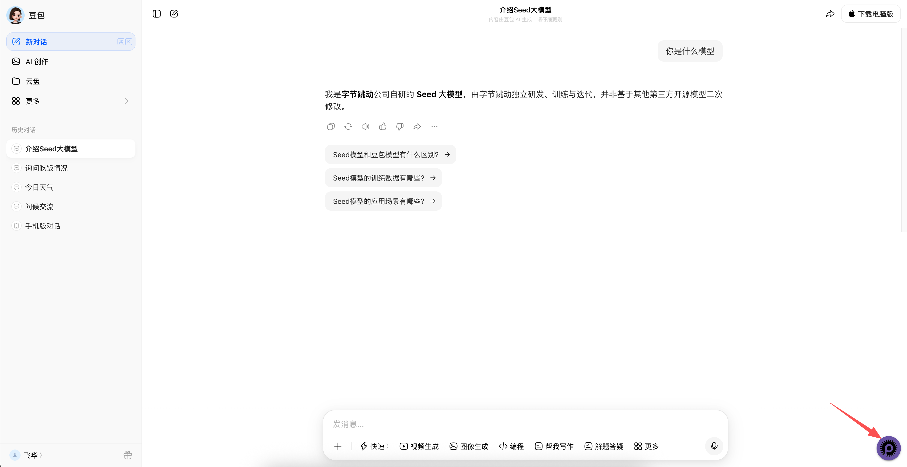
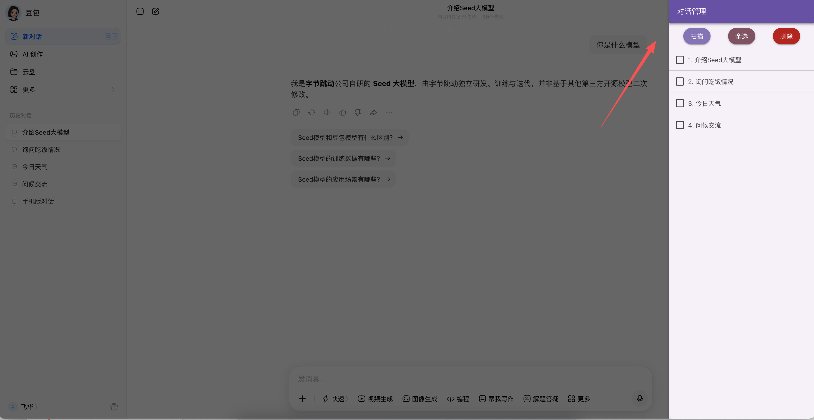

# 豆包会话管理工具

> 豆包会话管理、批量删除会话的油猴脚本

## 功能

- 扫描当前页面显示的所有会话
- 支持全选 / 取消全选
- 支持批量删除选中的会话
- 悬浮按钮，不影响正常使用

## 截图

**悬浮按钮**

脚本加载后在页面右下角显示一个可拖拽的悬浮按钮，点击「会话」展开管理面板。



**会话管理面板**

点击悬浮按钮后，右侧弹出会话管理面板，支持扫描、全选、删除操作。



## 安装

1. 安装 [Tampermonkey](https://www.tampermonkey.net/) 或 [Violentmonkey](https://violentmonkey.github.io/)
2. 点击 [安装脚本](https://greasyfork.org/scripts/你的脚本ID) 一键安装
3. 打开 [豆包](https://www.doubao.com/chat/) 即可使用

## 使用方法

1. 打开豆包页面，右下角出现悬浮按钮
2. 点击悬浮按钮，展开「会话」面板
3. 点击「扫描」扫描当前页面显示的会话
4. 勾选需要删除的会话，或点击「全选」
5. 点击「删除」批量删除选中会话

> **注意**：只能扫描到当前页面已加载显示的会话，页面未滚动到的会话无法扫描到。「手机版对话」会自动排除。

## 兼容性

| 浏览器 | 支持 |
|--------|------|
| Firefox + Violentmonkey | ✅ |
| Chrome + Tampermonkey | ✅ |
| Edge + Tampermonkey | ✅ |

## 开发

```bash
# 安装依赖
pnpm install

# 开发模式（豆包页面）
pnpm dev:doubao

# 打包
pnpm build:doubao
```

## 开源协议

[MIT] © feihua

## 源码

[GitHub](https://github.com/feihua666/particle)
